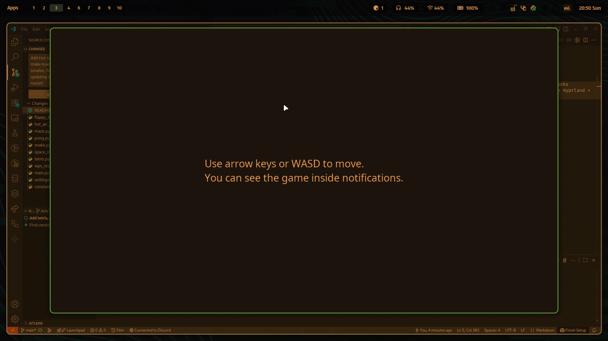

Games made inside notifications! Currently includes Flappy Bird, Maze, Pong, Space Invaders, Tetris and a WPS test!

Some parts of Tetris are based on my other project, ShatterStack, which is a Block Blast style game.

The whole thing is just completely unusable on Windows due to Windows having such a high animation delay for notifications. Also, on Windows, only the WPS test works normally, for other games you can try to lower notification rows and columns but i dont guarantee that anything is going to work. I only tested on Arch Linux with Hyprland + ML4W dotfiles, so your mileage may differ.

If you can't try it out, Snake, for example looks like this:
